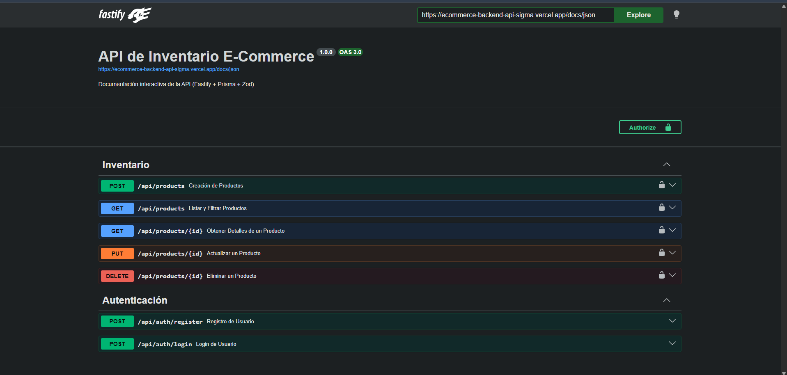
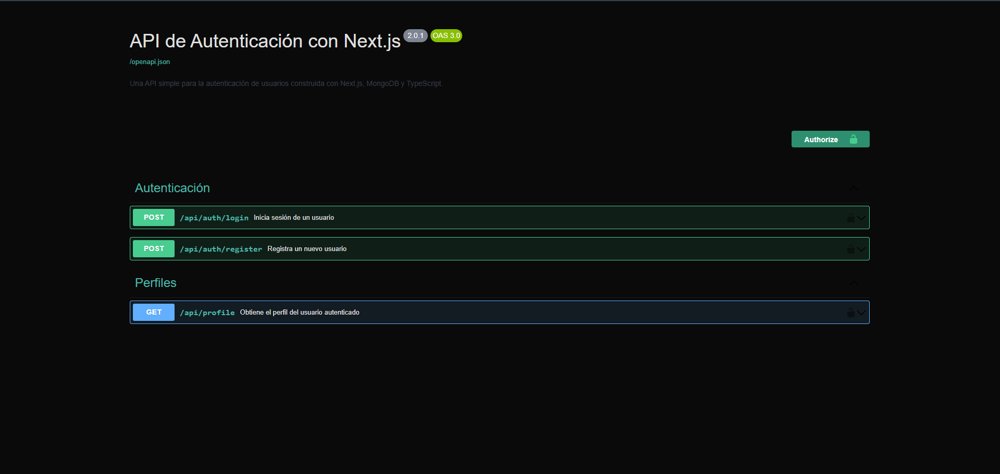
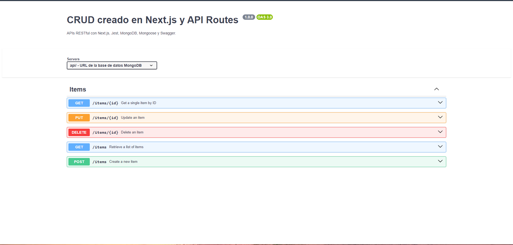
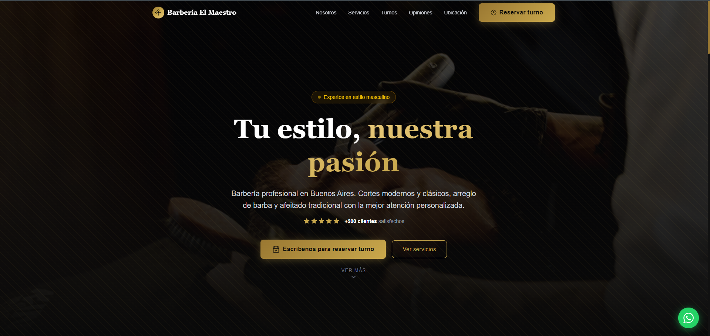

  

  

---

## 👋 Hola, soy Edinson Madrid  

🚀 **Frontend Developer especializado en React, Next.js y TypeScript**  
💻 Construyo interfaces escalables, optimizadas y orientadas a producto  
📈 Experiencia en aplicaciones en producción, integrando APIs y mejorando performance  

---

## 🧠 Sobre mí  

- +4 años de experiencia en desarrollo frontend  
- Especializado en React, TypeScript y Next.js  
- Experiencia integrando APIs REST y arquitecturas basadas en microservicios  
- Enfoque en performance, mantenibilidad y calidad de código  
- Testing con Jest y React Testing Library  
- Trabajo bajo metodologías ágiles (Scrum)  
- Background sólido como Analista Funcional (+10 años en IT)  

---

## 💼 Experiencia relevante  

He trabajado en entornos productivos desarrollando funcionalidades, corrigiendo incidencias y optimizando el rendimiento en aplicaciones web y mobile.

### 🛒 E-commerce  
- Desarrollo backend con Node.js, Express y PostgreSQL  
- Modelado de base de datos y lógica de negocio  
- CRUD de productos, usuarios y órdenes  
- Integración con pasarelas de pago  
- Automatización de emails y notificaciones  

### 📱 Aplicaciones web modernas  
- Desarrollo de interfaces con React y TypeScript  
- Integración con APIs REST  
- Mejora de performance y experiencia de usuario  

---

## 🚀 Proyectos Destacados  

### 🧾 App de Finanzas Personales  
Aplicación Mobile en React Native con Expo para gestión de gastos personales.

- CRUD de transacciones  
- Manejo de estado  
- Integración con API REST  
- Arquitectura escalable  
- Supabase como base de datos
- La uso de forma personal descargando .apk en mi dispositivo

💻 Código: https://github.com/edinsondevs/react-native-finance-app   

---

### 🏆 E-Commerce Inventory API (Producción)
API RESTful de alto rendimiento para gestión de inventario y autenticación, diseñada con arquitectura limpia, validación estricta y cobertura de tests al 100%.

- ⚡ Fastify (alto rendimiento)
- 🔷 TypeScript (tipado fuerte)
- 🧠 Prisma ORM (type-safe)
- 🛡️ Validaciones con Zod
- 🔐 Autenticación JWT
- 🧪 Testing con Vitest (100% coverage)
- 📄 Documentación Swagger/OpenAPI
- 🧱 Arquitectura limpia (services, routes, schemas)

👉 Deploy: https://api-ecommerce.edinsondigital.com/docs  
💻 Código: https://github.com/edinsondevs/ecommerce-backend-api  

---

### 🔐 API REST con Next.js (Auth + JWT)
API completa de autenticación y gestión de usuarios desarrollada con Next.js.

- 🔐 Autenticación con JWT
- ✅ Validación de datos
- 🧩 Arquitectura modular escalable
- 📦 Integración con base de datos
- 📄 Documentación interactiva con Swagger

👉 Deploy: https://api-login.edinsondigital.com/docs  
💻 Código: https://github.com/edinsondevs/api-login-register-nextjs

---

### ⚙️ API REST Full (CRUD + Swagger + Testing)
Plantilla backend robusta para creación de APIs RESTful.

- 🔁 CRUD completo (Create, Read, Update, Delete)
- 📚 Documentación Swagger/OpenAPI
- 🧪 Testing con Jest
- 🌱 Variables de entorno (.env)
- 🧱 Arquitectura limpia y escalable
- 🍃 Integración con MongoDB (Mongoose)

👉 Deploy: https://api-crud.edinsondigital.com/docs  
💻 Código: https://github.com/edinsondevs/next-api-rest-full

---

### 💈 Barbería El Maestro (Landing Page & Booking System)

Landing Page premium para barbería profesional con sistema de reserva de turnos en tiempo real integrado directamente con Google Calendar API.

- ⚡ Next.js 15+ (App Router) 
- 🔷 TypeScript (tipado estricto) 
- 🎨 Tailwind CSS 4 (estilos de última generación) 
- 📅 Google Calendar API (gestión de turnos dinámica) 
- ✨ Lucide React (iconografía minimalista) 
- 📱 Diseño Responsive (Mobile First & Premium UI) 
- 📩 WhatsApp Integration (conversión directa) 
- 🏗️ Arquitectura Modular (componentes desacoplados y configurables)

👉 Deploy: https://barberia-el-maestro.edinsondigital.com  
💻 Código: https://github.com/edinsondevs/barbershop-el-maestro

---

### 🌐 Landing Pages Profesionales  

- 💻 https://jenni-virtual-assistant.vercel.app/  
- 💻 https://www.isabellaspa.edinsondigital.com/  
- 💻 https://my-app-adoptions-pets.web.app/  

---

## 🚀 Stack principal  

Frontend enfocado en construcción de aplicaciones modernas, escalables y orientadas a producto

---

## 🛠️ Tecnologías  

<h3 align="center"> 🎨 Frontend </h3> 

 

<h3 align="center">🧪 Testing</h3>

 

<h3 align="center"> ⚙️ Backend (básico)  </h3>

 

<h3 align="center"> 🗄️ Base de datos  </h3>

 

<h3 align="center"> 🧰 Herramientas  </h3>

---

## 📫 Contacto  

🌐 Portfolio: https://portafolio.edinsondigital.com/  
💼 LinkedIn: https://linkedin.com/in/ingedinsonmadrid  

📩 Abierto a oportunidades como Frontend Developer (React / Next.js)  

---

## 📊 Estadísticas de GitHub  

<table><tr><td valign="top" width="50%">

</td><td valign="top" width="50%">

</td></tr></table>  

   

  
